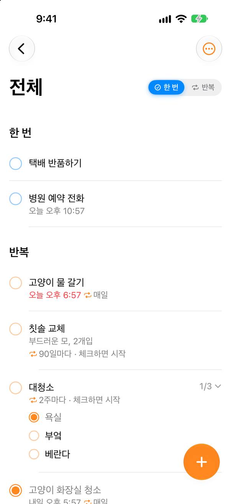
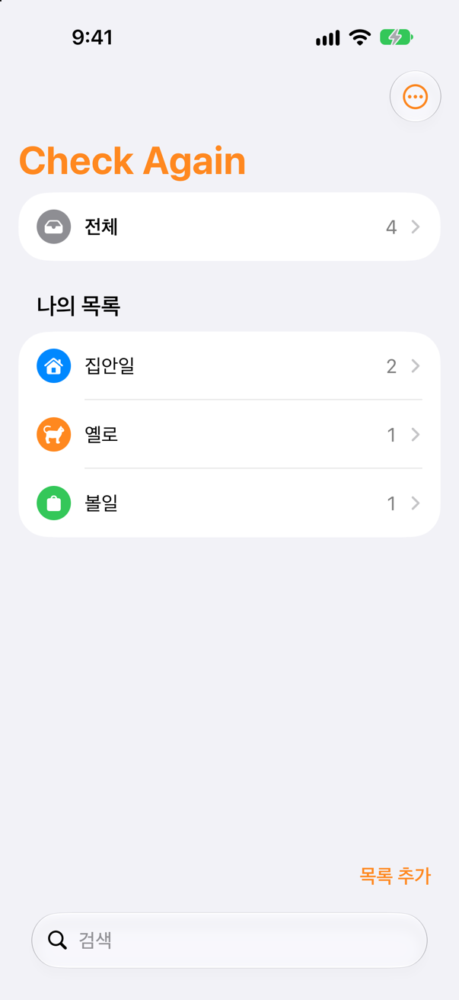
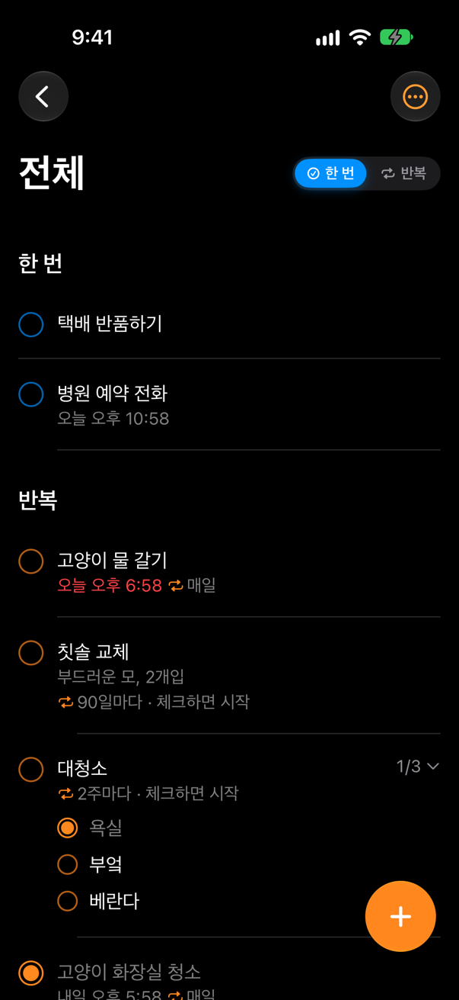
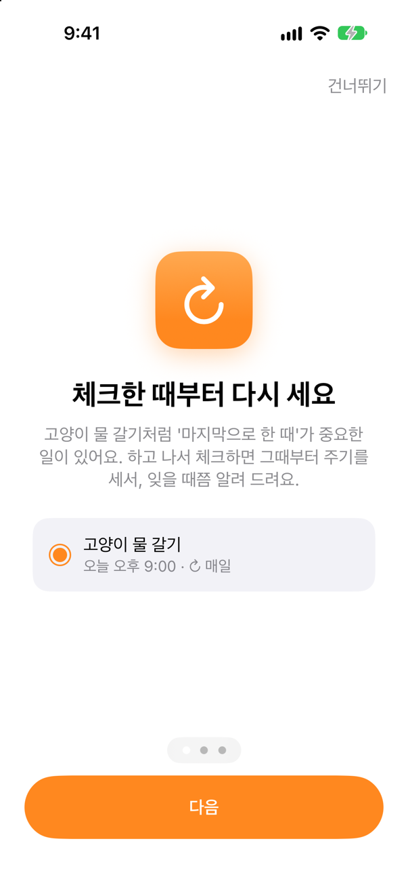
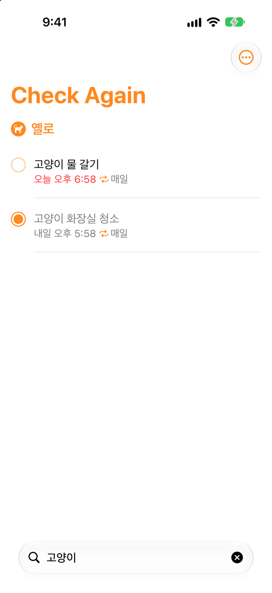
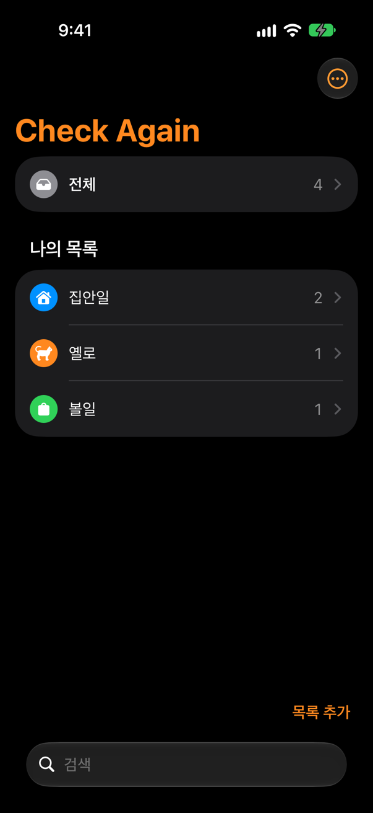

# Check Again

**마지막으로 한 때부터 다시 세서 알려 주는 할 일 앱 (iOS)**

> **English summary** — Check Again is an iOS to-do app that counts the next reminder from *when you last did it*, not from a fixed calendar time. Due items surface on the Home and Lock Screen widgets only when it's time, so you can stop keeping them in your head. Built with SwiftUI, SwiftData, WidgetKit and App Intents. This repository is a case study; the app's source is private, and the reminder scheduling engine is published under `ReminderEngine/`.

  
  
  

  
  
  

<!-- 위젯 · 잠금 화면 스크린샷 (실기기에서 추가 예정) -->

---

## 왜 만들었나

고양이 물 갈기와 화장실 청소는 "매일 오전 9시"가 아니라 **"마지막으로 한 때부터 24시간"**이 기준입니다. 그런데 아이폰 미리 알림의 반복은 달력 기준이라, 밤 11시에 늦게 하면 다음 알림이 10시간 뒤에 옵니다.

Check Again은 **체크한 순간부터 다음 주기를 셉니다.** 정수기 필터(6개월), 칫솔(3개월)처럼 간격이 길어서 잊기 쉬운 일일수록 효과가 큽니다.

## 주요 기능

- **완료 기준 반복**: 체크한 때부터 시간·일·주·월·년 단위로 다음 알림 (월·년은 달력 기준)
- **때가 되면 눈앞에**: 해야 할 일만 홈·잠금 화면 위젯에 나타나고, 다 하면 사라짐
- **다시 알림과 방해 금지 시간**: 체크하지 않으면 주기의 1/24 간격으로 최대 2번, 밤에는 아침으로 미룸
- **캘린더 기록**: 완료하면 캘린더에 자동 기록 (쓰기 전용 권한)
- **미리 알림 수준의 사용감**: 여러 목록, 한 번 할 일, 메모, 하위 항목, 검색, 끌어서 정렬

## 기술 스택과 구조

SwiftUI · SwiftData · WidgetKit · App Intents · UserNotifications · EventKit · App Group · Swift Testing

- **앱 + 위젯 확장 + 공통 코드(Shared)**: 모델, 알림 재예약, 일정 계산처럼 두 프로세스가 똑같이 동작해야 하는 코드를 함께 컴파일한다.
- **App Group 공유 저장소**: 위젯과 앱이 같은 데이터를 본다. 위젯에서 체크해도 알림 재예약과 캘린더 기록이 같은 규칙으로 이어진다.
- **저장할 때마다 알림 전체 재계산**: 64개 한도, 방해 금지 시간, 알림 센터 정리를 한곳에서.

> 그림과 흐름: [docs/architecture.md](docs/architecture.md)

## 설계 결정

| 결정 | 이유 |
|---|---|
| 다음 알림은 마지막 완료 시각부터 | 이 앱의 존재 이유. 달력 기준 반복의 간격 왜곡을 없앤다 |
| 다시 알림은 주기의 1/24, 최소 10분, 최대 2번 | "알림이 스트레스가 되면 안 된다" |
| 캘린더는 쓰기 전용 권한 + 5분 유예 | 기존 일정을 읽지 않는 신뢰 vs 취소 시 지울 수 없음, 그 사이의 절충 |
| 완료 기록에 제목 복사, 캘린더 연동 자리 선확보 | 나중에 구조 변경 없이 캘린더 연동을 붙였다 |
| 위젯 체크 여부는 설정이 아닌 위젯 종류로 | 요청한 사용자도 숨은 설정을 찾지 못했다 |
| 기존 데이터 이전은 이동이 아닌 복사 | 실사용 데이터가 있었다. 문제가 생겨도 되돌릴 수 있게 |

> 전체 15개: [docs/decisions.md](docs/decisions.md)

## 문제 해결 사례

- **[시작 속도: 가설을 버리고 측정으로 찾은 진짜 원인](docs/case-launch-time.md)** — "Debug라서 느리다"는 가설을 실기기 측정(첫 화면 0.1초)으로 기각. 원인은 화면 전환이었고, 덤으로 Release 빌드가 깨져 있던 걸 출시 전에 발견
- **[iOS 예약 알림 64개 한도와 스케줄러](docs/case-notification-limit.md)** — 모든 할 일의 알림을 합쳐 가장 가까운 64개만 예약, 저장할 때마다 재계산
- **[같은 원인의 크래시를 세 번: SwiftData 컨테이너 수명](docs/case-swiftdata-lifetime.md)** — 위젯 자리표시 화면 → 기기 크래시 로그 → "경계 밖으로는 값만 내보낸다"는 규칙

## 공개 코드: ReminderEngine

앱의 알림 일정 계산 엔진(완료 기준 반복, 다시 알림, 방해 금지 시간, 64개 한도)을 테스트와 함께 공개합니다. 화면·위젯·저장소 코드는 포함하지 않습니다.

> [ReminderEngine/](ReminderEngine/) · 테스트 19개 · GitHub Actions로 푸시마다 자동 실행

## AI와 함께 일한 방식

제품 판단(무엇을 왜 만들지, 좋은 경험의 기준, 언제 멈추고 측정할지)은 내가 하고, 구현·테스트·측정·문서화는 AI 코딩 도구(Claude Code)로 빠르게 했다. AI의 제안을 받아들이지 않은 경우와, AI가 놓친 것을 잡아낸 장치를 정리했다.

> [docs/working-with-ai.md](docs/working-with-ai.md)

## 다음 계획

- TestFlight 베타, App Store 출시
- iCloud 동기화와 백업

---

© 2026 skyun-ui. All rights reserved. 이 저장소는 사례 소개를 위해 공개하며, 코드의 사용 권한을 부여하지 않습니다.
