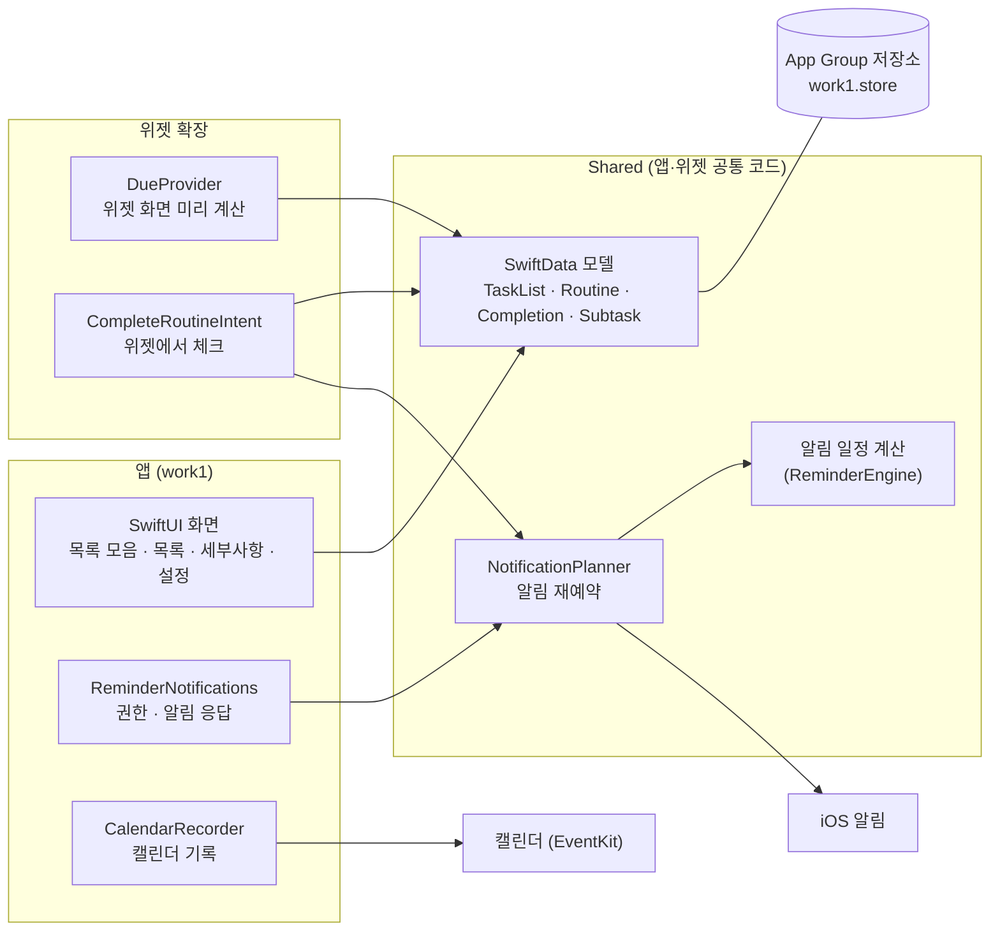
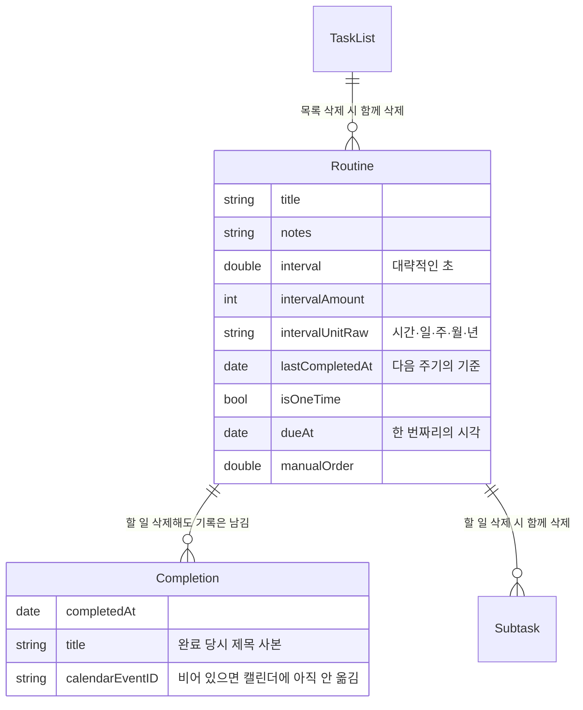
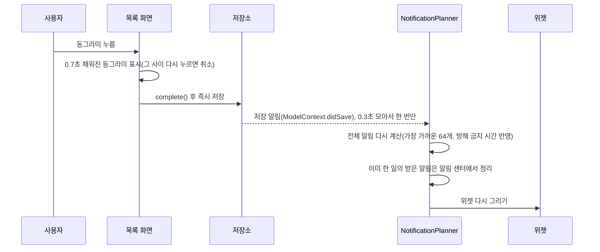

# 구조

## 한눈에 보기

- **타깃 3개**: 앱, 위젯 확장, 단위 테스트
- **Shared 폴더**는 앱과 위젯 확장 양쪽에 함께 컴파일된다. 모델, 알림 재예약, 일정 계산처럼 두 프로세스가 똑같이 동작해야 하는 코드만 둔다.
- **저장소는 App Group 공유 폴더**에 있다. 위젯은 앱과 다른 프로세스라서 앱 전용 폴더를 읽을 수 없기 때문이다.

## 데이터 모델

## 주요 흐름

### 앱에서 체크했을 때

### 위젯에서 체크했을 때
1. 위젯 확장의 `CompleteRoutineIntent`가 공유 저장소를 열어 완료 처리하고 저장한다.
2. 같은 `NotificationPlanner`로 알림을 다시 예약한다. 이미 한 일에 알림이 울리지 않는다.
3. "앱 밖에서 바뀜" 시각을 공유 설정에 남긴다. 앱이 다음에 활성화되면 이를 보고 저장소를 다시 열어 화면을 맞춘다.
4. 캘린더 기록은 앱에만 권한이 있으므로, 앱이 열릴 때 기록되지 않은 완료를 찾아 옮긴다.

### 위젯 화면
- 위젯은 실시간으로 갱신되지 않는다. 그래서 "할 일이 새로 나타나는 시각"마다 위젯 화면을 미리 만들어 둔다(최대 30장).
- 위젯은 SwiftData 객체가 아닌 값(`DueItem`)만 들고 그린다. 저장소를 닫은 뒤 객체 속성을 읽으면 크래시가 나기 때문이다. → [사례](case-swiftdata-lifetime.md)

## 테스트
- 앱: Swift Testing 52개. 일정 계산, 목록 구역·정렬, 위젯 표시 순서, 데이터 이전(실제 SQLite 파일 복사), 캘린더 기록 대상 선정 등.
- 공개 엔진: 19개, GitHub Actions에서 자동 실행.
- 저장 구조를 바꿀 때마다 **실기기 데이터 사본**을 시뮬레이터에서 새 버전으로 열어, 기존 할 일이 그대로 열리는지 확인했다.
